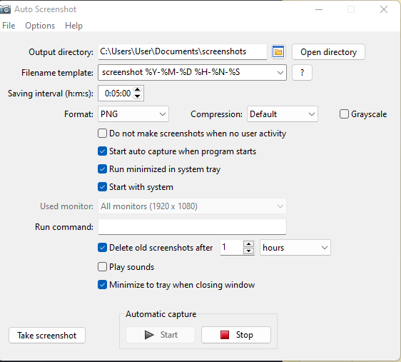
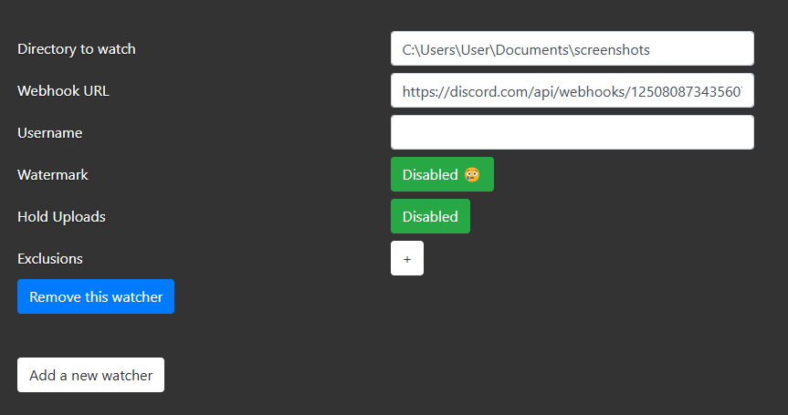

import React from 'react';
import TopBanner from '@site/src/components/TopBanner';
import ContentBlock from '@site/src/components/ContentBlock';
import BrowserWindow from '@site/src/components/BrowserWindow';

<TopBanner title="Bot Monitoring" version="v1.0" author="1464"></TopBanner>

:::hidden
# Creating a Discord Server
:::
<ContentBlock title="Creating a Discord Server"></ContentBlock>

## Step 1: Create a Server
1. **Open Discord**: Log in to your Discord account.
2. **Click on the "+" button**: This is located on the bottom left of the sidebar.
3. **Create a Server**:
   - Choose the option "Create My Own" or use a template.
   - Enter a server name.
   - Optionally, upload an icon for your server.
   - Click "Create".

### (Optional) Step 2: Customize a Server

1. **Create Channels**:
   - **Text Channels**: Click the "+" next to "Text Channels" to add channels (e.g., #general, #announcements).
   - **Voice Channels**: Click the "+" next to "Voice Channels" to add channels (e.g., General).
   - **Categories**: Organize channels into categories by clicking the "+" next to the server name and selecting "Create Category".

2. **Set Up Roles**:
   - Go to "Server Settings" (click on your server name at the top and select "Server Settings").
   - Click on "Roles" and then the "+" button to create new roles.
   - Customize permissions for each role (e.g., Admin, Moderator, Member).
   - Assign roles to members by right-clicking on their username and selecting "Roles".

--

:::hidden
## Setting Up Auto Screenshot Software
:::
<ContentBlock title="Setting Up Auto Screenshot Software"></ContentBlock>

### Step 1: Download the Software
1. **Visit the Official GitHub repo**: Go to the [Auto Screenshot](https://github.com/artem78/AutoScreenshot) GitHub page.
- All credits to [<i>artem78</i>](https://github.com/artem78), support him if you like the software!
3. **Download the Installer**: Scroll to the bottom and download either the Windows portable version or installer.
- <i>AutoScreenshot_v1.16_Windows_portable.zip</i> or <i>AutoScreenshot_v1.16_Windows_setup.exe</i>

### Step 2: Configure Auto Screenshot
1. **Choose Save Location and Filename template**: Select the output directory folder where the screenshots will be saved together with Filename template which will be used to name the files.
2. **Set Screenshot Intervals**: In the application settings, configure the intervals at which screenshots should be taken.
3. **Adjust Capture Settings**: Configure additional settings like image format, compression and various checkboxes.
- <b>DO NOT</b> check the <i>"Do not make screenshots when no user activity"</i> option!
4. **Set Deletion Intervals**: To prevent cluttering space, set a reason able time interval in which the taken screenshots will be automatically deleted.

### Step 3: Start Taking Screenshots
1. **Start the Service**: Click on the "Start" button within the application to begin automatic screenshot capture.
2. **Monitor Activity**: Ensure the application is running in the background to continuously capture screenshots at the set intervals.

---

:::hidden
## Setting Up Auto Upload to Discord Server
:::
<ContentBlock title="Setting Up Auto Upload to Discord Server"></ContentBlock>

### Step 1: Download the Software
1. **Visit the Official GitHub repo**: Go to the [DAU](https://github.com/tardisx/discord-auto-upload) GitHub page.
- All credits to [<i>tardisx</i>](https://github.com/tardisx), support him if you like the software!
2. **Download the Installer**: Scroll to the bottom and download binaries for Windows.
- <i>dau-win-v0.12.4.zip</i>

### Step 2: DAU Config
1. **Unzip the downloaded file and open the DAU app**: This should automatically open your browser windows and land you on the localhost:9090 page.
- Go to Config tab at the top menu.
2. **Global configuration**: Lets you setup server ports and general startup settings.
3. **Watcher configuration**: This is where you setup a webhook to your discord server. Multiple watchets can be setup to upload to multiple servers.
- Firstly, check this [link](https://support.discord.com/hc/en-us/articles/228383668-Intro-to-Webhooks) for a step by step guide on how to get your Discord server Webhook URL.
- After you have everything ready, simply copy and paste the directory path for where your screenshots folder is located.
- Then paste the Webhook URL you just created.
- Lasty, save the settings at the bottom of the page.

### Step 3: Finishing up
**Monitor Uploads**: Ensure that the script is running and check the Discord channel to confirm that the screenshots are being uploaded automatically.
- You can set both app to start on startup or open them manually whenever you restard your computer.

<b>Happy botting!</b>