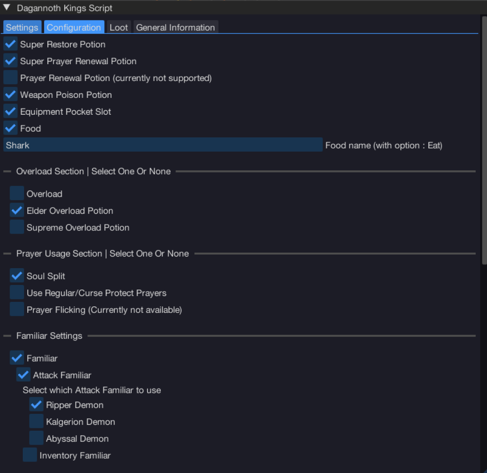
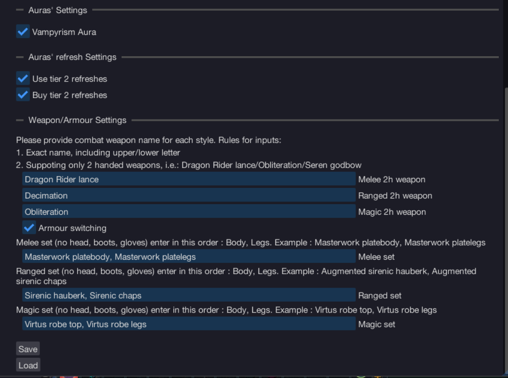
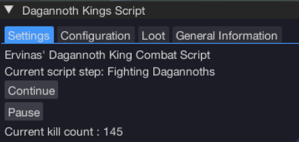

import React from 'react';
import TopBanner from '@site/src/components/TopBanner';
import ContentBlock from '@site/src/components/ContentBlock';
import Changelog from '@site/src/components/Changelog';
import BrowserWindow from '@site/src/components/BrowserWindow';
import changes from './changes.json'

<TopBanner title="Ervinas Dagannoths Kings" version="v1.1.0" author="Ervinas" skill="Attack">
</TopBanner>

:::hidden

## Cost

:::

<ContentBlock title="Cost">

> - 23$ / month (not including client access)

</ContentBlock>

:::hidden

## Requirements

:::

<ContentBlock title="Requirements">

> - Access to Soul Split. **RECOMMENDED**
> - Access to War's Retreat.
> - Access to Dagannoth Kings instance teleport.
> - Be able to have/use Overloads.
> - Render distance : medium.
> - Atleast T80 Weapons/Armour or T70 with Blood amulet of fury should be enough to self sustain life.
> - Higher summoning for better BoB. Or better DPS.
> - Magic notepaper - the more, the better.

</ContentBlock>

:::hidden

## What Script does

:::

<ContentBlock title="What Script does">
> - Banking - using option : "Load Last Prefer From".
> - Uses Campfire.
> - Uses Altar of War.
> - Weapon switches to corresponding Dagannoth.
> - Armour switches to corresponding Combat style.
> - Automaticly creates boss instance or rejoins if it exists.
> - Walks to random mid arena spot.
> - Heals itself if life < 4500.
> - Drink prayer related potion (Super Restore) at this moment when prayer < 300.
> - Has a safety mechanic, if life < 3500 and no food is left, gets back to War's Retreat.
> - Drinks Elder overload/Overloads during the fight.
> - Drinks Weapon Poison.
> - Using Magic notepaper on items in inventory when it's full.
> - Loots items, according to your specifics.
> - Uses Pocket Item if it's available.
> - Endless cycle, even if you have backed to War's Retreat mid fight.
> - Uses Revolution.
> - Uses Soul Split
> - Uses Regular/Curse Protection Prayers if Soul Split is turned off in settings.
> - Uses Familiars, such as BoB or DPS.
> - Eats from BoB.
> - Resummons familiars if time left < 10 mins.
> - **NEW** Uses Vampyrism Aura
> - **NEW** Buys and Uses Tier 2 Aura refresh on Vampyrism Aura if **enabled**

</ContentBlock>

:::hidden

## UI Game Configuration

:::

<ContentBlock title="UI Game Configuration">
> - Render Distance : medium.
> - Dagannoths Kings Boss Instance teleport on the left portal.
> - War's Retreat teleport somewhere in action bar.
> - Revolution Bars are setuped individually, how you want you character to perform.
> - Make sure in Combat Options you are enabled threshold and ultimate ability autocast.
> - **Soul Split** and **Protection Prayers** has to be somewhere in Action Bar if you are planning to use.
</ContentBlock>

:::hidden

## Script Configuration

:::

<ContentBlock title="Script Configuration">
> - Script has a configuration tab. Check it out and it's **mandatory** to fill it as **precise** as **possible**.
> - Script configuration can be saved and loaded. On client restart it will not load last configuration due to bot client funcionality.

Configuration Tab Example with Explanation (My personal Settings)

> - Super Restore Potion - Check if you are planning to use it. **RECOMMENDED**
> - Super Prayer Renewal Potion - Check if you are planning to use it, if you are not planning/able to use it, leave it unchecked.
> - Overload/Supreme/Elder Overload Potion - Check which you are going to use, if none - do not check any.
> - Weapon Poison Potion - Optional.
> - Equipment Pocket Slot - Mainly used for books: Wen/Jas/Grimoire/Illumination etc, as long it has "Activate/Deactivate" option.
> - Food - **HIGHLY RECOMMENDED**, it will pop a new text insertion in which you have to write **PRECISE** name of a food, which has option **EAT**.
> - Weapon and Armour is fully written in the script. Read closely.
> - Familiars (Fighting and Inventory) Supported :
>> - Beast of Burden :
>>> - Spirit Terrorbird
>>> - War Tortoise
>>> - Pack Yak
>>> - Pack Mammoth
>> - DPS :
>>> - Ripper Demon
>>> - Kalgerion Demon
>>> - Abyssal Demon
> - Aura Support :
>> - **NEW** Uses Vampyrism Aura
>> - **NEW** Use tier 2 refreshes
>>> - Script is capable of determining if you have refreshes, and uses if you have **enabled** this option
>> - **NEW** Buy tier 2 refreshes
>>> - Script is capable of buying tier 2 refreshes if you have enough Marks of War and if you have **enabled** this option. It does that on every route start at War's Retreat.

</ContentBlock>

:::hidden

## How to start botting

:::

<ContentBlock title="How To Start Botting">
> - Make sure you are in **War's Retreat**.
> - Make sure you are standing somewhere new the bank/altar/campfire.
> - Make sure Dagannoth Kings Boss Instance teleport is active on the left.
> - A bit **zoom out** camera, to be able to see left portal.
> - Configure script in **Configuration** and **Loot** tabs as **precise** all possible.
> - Have atleast 5 free inventory spaces for loot.
> - Have some food to **jumpstart** the script at bosses.
> - Have 150k coins in your backpack for instance creation. (recommendation have more for longer sessions)
> - **Soul Split** and **Protection Prayers** has to be somewhere in Action Bar.
> - Happy Botting.
</ContentBlock>

:::hidden

## Preset

:::

<ContentBlock title="Preset And Gear">
> - Script is using preset - **"Load Last Preset from"**
> - If BoB is turned on, please setup it before starting!
>> - Summon BoB, load with same food as you are planning to use and save BoB inventory.
>> - Add a pouch to your preset and you are ready to go.

My Personal Preset

> - Gear for switching.
> - 1x Weapon Poison+++.
> - 2x Elder Overload Potions.
> - 2x Super Prayer Renewal Potions.
> - 3x Super Restores
> - 4x Sailfishes
> - Notepaper (mandatory)
> - Sping cleaner (OPTIONAL)

My Personal Gear

</ContentBlock>

:::hidden

## Looting

:::

<ContentBlock title="Loot">
> - Script provides ability to loot. Take a look at Script Settings "Loot" Tab.

Loot Tab

> - Just check what you want to loot.
> - Everything you check will be picked up.
> - When inventory is full, script will use notepaper.

</ContentBlock>

:::hidden

## Youtube Video

:::

<ContentBlock title="Youtube Video">
<iframe width="560" height="315" src="https://www.youtube.com/embed/DvsdVobusuQ?si=aLhZqSB_k2XfdbJt" title="YouTube video player" frameborder="0" allow="accelerometer; autoplay; clipboard-write; encrypted-media; gyroscope; picture-in-picture; web-share" referrerpolicy="strict-origin-when-cross-origin" allowfullscreen></iframe>
</ContentBlock>

:::danger Little more

- **Please read "General Information" tab in script Settings before trying to START it**
- **You will see two buttons : CONTINUE/PAUSE.**:
> - Continue button will resume script if paused.
> - Pause button will pause script if it's running.
> - Top bar "Play" button will start the bot. Start can be done from anywhere, due to using Teleport to War's from Ability bar.
> - If something went wrong, please use top bar to stop the script, refresh and start it again, it will start from beginning (tp to war's).

:::

:::hidden

## Additional Information

:::

<ContentBlock title="Additional Information">
> - Script is suitable now for account which doesn't have **Soul Split**, will use regular protection prayers instead for each individual dagannoth.
> - If you encouter bugs, please contact me @Ervinas in discord, providing a video would help a lot.
> - If there are suggestions or desires what to add to this script - @Ervinas.
> - Happy Botting. AGAIN.
</ContentBlock>

:::

## Changelog

:::

<Changelog changes={changes}>

</Changelog>
