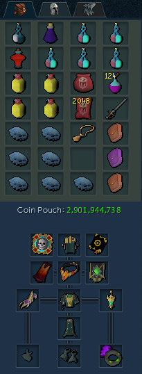

import React from 'react';
import TopBanner from '@site/src/components/TopBanner';
import ContentBlock from '@site/src/components/ContentBlock';
import Changelog from '@site/src/components/Changelog';
import BrowserWindow from '@site/src/components/BrowserWindow';
import changes from './changes.json'

<TopBanner title="SanctumWithUs [Normal] " version="v1.0" author="Pizzanova" skill="Necromancy">
</TopBanner>

:::hidden

## Cost

:::

<ContentBlock title="Cost">

> - $60 USD / month (not including client access)
:::danger Limitations
- **Sanctum of Rebirth is still very new, So any GP/H Claims are very volitale.**
:::
</ContentBlock>

:::hidden

## Features

:::

<ContentBlock title="Features">

> - **SanctumWithUs Script**: Completes runescapes newest boss dungeon Sanctum of Rebirth on normal mode!
> - **Customizable Settings**: Many settings to try and get it perfect for your account.
> - **Safety Features**: Various failsafes to ensure you don't get stuck. (If you found ur account logged out and cant find why read list below.)
> - **Current GP Rates**: Since Sanctum of Rebirth is new, no droprates have been released yet, and current item prices are very volitale so i dont feel comftable giving a GP Estimate.
> - **Average Kill Times**: Averaging around 8 Min dungeon complete time on Bis charcters currently.

<strong>Safety Features Details</strong>

- Teleport to Wars and logout if any of these conditions become true:
  - If you run out of Divine Charges.
  - If your preset is missing items.
  - If your missing Runes OR ectoplasm
  - If you have an unbankable item in your invent

</ContentBlock>

:::hidden

## Requirements

:::
<ContentBlock title="Requirements">

> **The requirements here are required to take it on, make sure you meet those listed.**
> - T90+ Necromancy Weapons
> - Dive ability unlocked.
> - 99+ Necromancy and all necromancy abilities and incantations unlocked from the well of Souls.
> - Overloads potions i would not recommened anything lower.
> - Plenty of PVM supplys. (Blubbers,Brews,Overloads,Adrenpots,Prayer,Runes)

<ContentBlock title="Optional Requirements">

> **Having all Possible requirements ticked off will ensure a much better kill and result from this script**
> - Please note rotations with pre t95 Rotations are not fully optimal expect slightly slower results then advertised.
> - Zuk Cape
> - Essence of Finalty with the Death Grasp Ability added.
> - Vulnerability bomb.
> - Disruption shield and lunar spellbook swap.
> - Smoke cloud .
> - Good invention perks on your gear.
> - Good archeolgy relics.

</ContentBlock>
</ContentBlock>
:::hidden

## Setup

:::
<ContentBlock title="Setup">

<strong>Action Bar Setup</strong>

> - Check the Script console when running to see missing abiltys...
> - Make sure to resave abiltys after changing script settings.
> - Please make sure all mandatory abiltys are on your bar.
> - Please make sure any abiltys you opt in for is also on your bar.

>- CURSES_________
> - Quick Prayers 1 set to Protect from melee and T95/T99 Prayer
> - Quick Prayers 2 set to Protect from range and T95/T99 Prayer
> - Quick Prayers 3 set to Protect from magic and T95/T99 Prayer
> - Quick Prayers 4 set to Soulsplit and T95/T99 Prayer

> - STANDERD PRAYERS_________
> - Quick Prayers 1 set to Protect from melee and offensive Prayer
> - Quick Prayers 2 set to Protect from range and T95/T99 Prayer
> - Quick Prayers 3 set to Protect from magic and T95/T99 Prayer
> - Quick Prayers 4 set to Soulsplit and T95/T99 Prayer
> - Your offensive prayer should ideally be Sancity && the new prayer Divine Rage (Its cheap buy it.)

> - Below if ur confused on how to do

<strong>Inventory Setup</strong>

> *Make sure your preset contains the following...*
> - An overload (any).
> - An Adrenline potion, Any works but renewals are recommended.
> - Essence of Finalty.
> - Something to restore prayer, it will support anything with "Prayer" or "Restore" in the name.
> - Vuln bombs, they are not required but make sure to have them in your inventory if uve toggled the option.
> - Brews and jellyfish, try to have a even ratio of 3 jellys to 1 brew.
> - Runepouchs / Nexus make sure you have all runes that you need for every incantation and spells that need to be cast.
> - Excalibur.
> - Ur familer, every ancient familer is supported.
> - Expensive Spices.
> - Script is in early days, please expermient with gear to see what gets you the best results.

<strong>Misc Setup</strong>

> *Make sure you have the following conditons true*

> - Turn walk markers on.
> - Turn auto-retaliate off.
> - Full manual on, ability queuing off, auto necro basic attack off.
> - Draw distance to medium or lower.
> - Set boss portal to left portal.
> - Make sure you have plenty of divine charges, book charges, runes, and other items to run for a long time.
> - If you are using a reaver, set the autofire rate for healing.
> - If using auras, make sure your aura management is not in list view.

</ContentBlock>

:::hidden

## Changelog

:::

<Changelog changes={changes}>

</Changelog>
