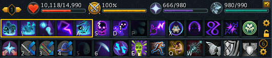
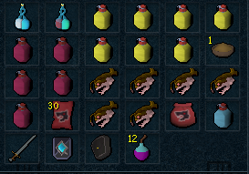

import React from 'react';
import TopBanner from '@site/src/components/TopBanner';
import ContentBlock from '@site/src/components/ContentBlock';
import Changelog from '@site/src/components/Changelog';
import BrowserWindow from '@site/src/components/BrowserWindow';
import changes from './changes.json'

<TopBanner title="Stack Tzkal Zuk NM" version="v1.0" author="Overflow" skill="Necromancy">
</TopBanner>

:::hidden

## Cost

:::

<ContentBlock title="Cost">

> - $15 USD / week (not including client access)
</ContentBlock>

:::hidden

<ContentBlock title="Features">
Completes TzKal-Zuk Normal Mode, waves and boss encounter using Necromancy. Currently, averages approximately 3 kph with equipment and supply recommendations noted below.

</ContentBlock>

:::hidden

## Requirements

:::
<ContentBlock title="Requirements">
> Please note the script has been tested with the below, kills may be achievable with lesser gear however deaths may be more likely and the speed will reduce.
> - 99 Necromancy,
> - All talent tree unlocks,
> - Conjure Undead, with all 3 conjures active and sufficient Ectoplasm to run,
> - T90 Tank Armour,
> - T95 Curses (Deflect Melee/Ranged/Magic, Soulsplit, Sorrow)
> - Wars Retreat Unlocks, (Campfire, Prayer Alter, Portal assigned to TzKal-Zuk)
> - Supreme Overloads
> - Mobile Perk or Relic Active,
> - Ensure a minimum of 500 of each 4 No. Necrotic runes with Greater Bone Shield active prior to start of each run.
</ContentBlock>
:::hidden

## Setup

:::
<ContentBlock title="Setup">

<strong>Action Bar Setup</strong>

Please ensure revolution ++ is active and all abilities / prayers / spells / incantations noted are available on Actionbar

<strong>Inventory Setup</strong>

Script has been tested with the inventory shown, so please ensure that a preset is set and loaded once prior to starting script

<strong>Additional Notes</strong>

- Devoted / Enhanced devoted perks will help significantly,
- Will use vuln bombs on Har Aken and TzKal-Zuk if in inventory
- Summoning Familiars can be toggled, will renew pouches when necessary, not all special attacks implemented yet.
- Scriptures can be toggled, will activate 4 main scriptures (Jas, Wen, Bik, Ful)
- Enhanced Excalibur, will use automatically if in inventory.
- Elven Ritual Shard, will use automatically if in inventory.
- Deaths are still possible (Unlucky Jad Melee Swipes), will death walk and rebuy gear as required. Please ensure sufficient GP in money pouch to rebuy gear.
- If deaths are encountered at other points whilst meeting the requirements above please let me know and i will review script logic.

</ContentBlock>

:::hidden

## Changelog

:::

<Changelog changes={changes}>

</Changelog>
