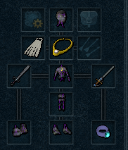
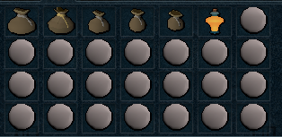

import React from 'react';
import TopBanner from '@site/src/components/TopBanner';
import ContentBlock from '@site/src/components/ContentBlock';
import Changelog from '@site/src/components/Changelog';
import BrowserWindow from '@site/src/components/BrowserWindow';
import changes from './changes.json'

<TopBanner title="SoulCraftWithUs" version="v1.0.0" author="BotWithUs" offical="OFFICAL SCRIPT" skill="Runecrafting">
</TopBanner>

:::hidden

## Cost

:::

<ContentBlock title="Cost">

> - Free!

</ContentBlock>

:::hidden

## Features

:::

<ContentBlock title="Features">

> - Creates soul runes via abyss and legends cape.
> - Supprots abyssal titan and powerburst of sorcery
> - Supports wilderness sword teleing, otherwise it uses edge lodestone
> - Surges if surge is on the actionbar.
> - Uses dive/bladed dive if on actionbar.
> - Loads last bank preset
> - Will use powerburst of sorcery if in preset
> - Will summon abyssal titans from your bank (make sure you have plenty) - recharges points at obelisk near GE.
> - Great XP, average money, and a godsend for irons.

</ContentBlock>

:::hidden

## Requirements

:::
<ContentBlock title="Requirements">

- 'Phite Club quest completed
- A bank preset similar to the example
- Legends quest complete & cape equipped
- Edgeville sword equipped
- Phoenix necklace recommended
- Use demonic skull at your own risk.

</ContentBlock>

:::hidden

## Changelog

:::

<Changelog changes={changes}>

</Changelog>
